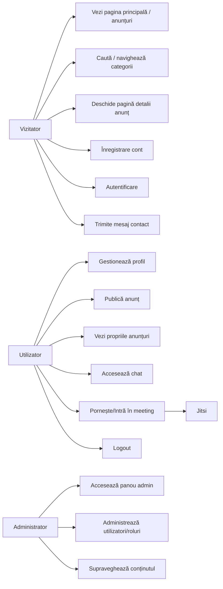

# SkillSwap — Schemă Use Case (versiune simplificată)

## 1) Actori
- Vizitator (neautentificat)
- Utilizator (autentificat)
- Administrator
- Sistem extern: Jitsi (video meeting)

## 2) Diagramă schematică (Mermaid)

## 3) Use Case-uri pe rol

### Vizitator
1. Vizualizează anunțuri și categorii
2. Deschide detalii anunț
3. Creează cont nou
4. Se autentifică
5. Trimite mesaj prin formularul de contact

### Utilizator
1. Completează/editează profilul
2. Creează și publică anunț
3. Vizualizează lista proprie de anunțuri
4. Folosește chat-ul (UI)
5. Accesează meeting-ul video (integrare Jitsi)
6. Se deloghează

### Administrator
1. Accesează zona de administrare
2. Gestionează roluri și utilizatori
3. Monitorizează conținutul aplicației

## 4) Flux principal (end-to-end)
1. Vizitatorul intră pe platformă și explorează anunțuri
2. Se înregistrează sau se autentifică
3. Devine utilizator și publică un anunț
4. Comunică prin chat / contact
5. Opțional intră în meeting video prin Jitsi

## 5) Notă
- Aceasta este o reprezentare schematică, ușor de citit, inspirată din Use Case Diagram UML.
- Poate fi extinsă ulterior cu relații `include` / `extend` și cu reguli detaliate pe fiecare caz de utilizare.

